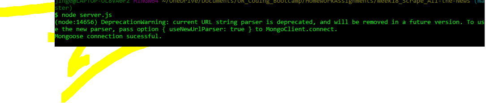

# Week18_Scrape_All-the-News

1.  Create a GitHub repo for this assignment and clone it to your    computer. Any name will do -- just make sure it's related to this project in some fashion.

2.  Run npm init. When that's finished, install and save these npm packages:

3.  express

4.  express-handlebars

5.  mongoose

6.  body-parser

7.  cheerio

8.  request
9.  NOTE: If you want to earn complete credit for your work, you must use all six of these packages in your assignment.

10. In order to deploy your project to Heroku, you must set up an mLab provision. mLab is remote MongoDB database that Heroku supports natively. Follow these steps to get it running:

11. Create a Heroku app in your project directory.

12. Run this command in your Terminal/Bash window:

* `heroku addons:create mongolab`

* This command will add the free mLab provision to your project.

A.  When you go to connect your mongo database to mongoose, do so the following way:

// If deployed, use the deployed database. Otherwise use the local mongoHeadlines database
var MONGODB_URI = process.env.MONGODB_URI || "mongodb://localhost/mongoHeadlines";

// Set mongoose to leverage built in JavaScript ES6 Promises
// Connect to the Mongo DB
mongoose.Promise = Promise;
mongoose.connect(MONGODB_URI);